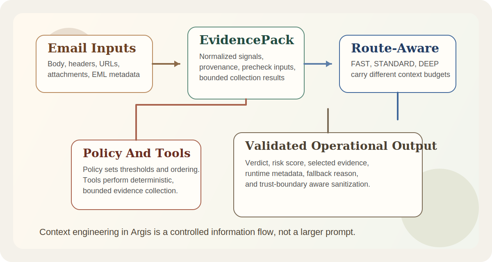
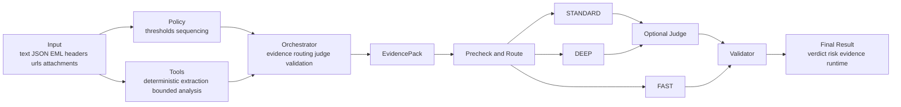
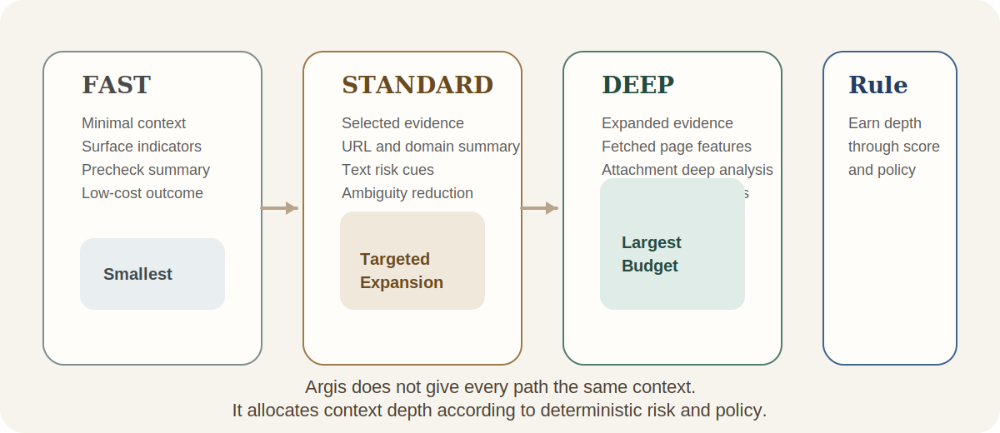
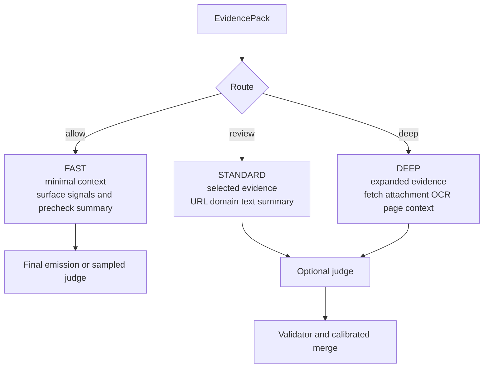

# Context Engineering In Argis

*Designing bounded, evidence-first context for phishing email detection*

Context engineering is often described as the art of deciding what enters a model window. That framing is directionally correct, but it is incomplete for production systems. In a real security runtime, the harder question is not only what the model should see. It is what the system should collect, how that information should be normalized, which stage is allowed to consume it, and what must remain available for validation and audit even if it never reaches a model.

That is the problem Argis is designed to solve.

Argis is not a general-purpose chat agent. It is a phishing email detection system built around a deterministic-first control stack. It has to analyze heterogeneous artifacts such as message text, headers, URLs, domains, and attachments. It has to keep high-risk outcomes evidence-backed. It has to maintain explicit trust boundaries between API and local CLI execution. It also has to degrade safely when optional remote model evaluation is unavailable.

In that environment, context engineering is not prompt decoration. It is runtime architecture.

This article is informed by the broader industry shift highlighted in AWS's discussion of context engineering for agentic systems: [Agentic AI Infrastructure Practice Series (9): Context Engineering](https://aws.amazon.com/cn/blogs/china/agentic-ai-infrastructure-practice-series-nine-context-engineering/). The focus here, however, is narrower and more operational: how those ideas apply to Argis as it exists today.

## Context In Argis Is More Than Prompt Text

In many systems, "context" is still used as a synonym for prompt content. That is too narrow for Argis. The runtime works with several distinct context classes, each of which has a different lifecycle and a different security posture.

1. Input context  
Normalized email content, structured request fields, headers, URLs, attachment identifiers, and EML-derived metadata.

2. Evidence context  
Structured signals produced during analysis, such as header authentication mismatches, hidden links, domain risk findings, attachment checks, NLP cues, and component scores.

3. Decision context  
The route, path, judge eligibility, selected summaries, and stage-specific working set used to make the next runtime decision.

4. Audit context  
Evidence references, provenance, limits hit, errors, fallback reasons, validation outcomes, and runtime metadata.

The critical point is that these are not supposed to flow through the system in the same way.

Some information belongs in the `EvidencePack`. Some belongs in route-specific working context. Some should be visible in sanitized API output. Some should be retained only for traceability or operator diagnostics. Treating all of it as "prompt material" would collapse important engineering boundaries and reduce the system's ability to explain itself.

## Why Phishing Detection Makes Context Engineering Hard

Phishing detection is unusually sensitive to context design because the input is inherently multi-artifact and the operational cost of over-collection is high.

A single message may require the runtime to reason about:

- social-engineering language in the visible body
- hidden or mismatched links in HTML
- sender and reply-to inconsistencies
- domain reputation and risky TLD signals
- attachment-level surface indicators
- fetched page content for landing pages
- OCR, QR decode, or audio-derived content when deep analysis is enabled

The system therefore faces two competing risks:

- If it collects too little, it misses the artifact that explains the threat.
- If it collects too much, it raises latency and cost, expands the side-effect surface, and buries the important evidence under irrelevant detail.

Argis is designed around the idea that the system should not pay for maximum context on every message. It should earn deeper context through deterministic signals and route selection.

## The Architectural Constraint Matters

Argis follows a layered architecture:

- `policy`: what to do and in what order
- `tools`: deterministic execution capabilities
- `orchestrator`: evidence building, routing, judge usage, fallback, validation
- `api`, `ui`, `cli`: delivery surfaces

That dependency direction is not merely aesthetic. It determines how context may be produced and consumed.

- Policy may define thresholds and sequencing, but it must not perform side-effectful collection.
- Tools may collect deterministic signals, but they should not own high-level routing policy.
- The orchestrator is responsible for deciding how evidence turns into route-aware working context.
- Delivery interfaces may expose results, but they must not expand trust assumptions or bypass sanitization rules.

This gives Argis a useful property: context is not assembled by a single monolithic prompt builder. It is staged through explicit control points.

## Why Argis Centers Context Around `EvidencePack`

The most important context-engineering decision in Argis is that the runtime is centered on `EvidencePack`, not on a large undifferentiated prompt.

That matters because `EvidencePack` separates collection from consumption.

The evidence stage builds a structured representation of what has been observed:

- normalized email metadata
- header authentication and mismatch signals
- URL- and domain-level indicators
- attachment surface checks
- NLP cues
- provenance and limits
- deterministic pre-score inputs

Only after that structure exists does the rest of the system decide what to do with it.

This design yields four practical benefits.

### 1. Noise Is Reduced Before Model Involvement

Raw HTML, fetched page bodies, redirect chains, and attachment-derived content are often verbose and only partially relevant. By extracting structured signals first, Argis reduces the amount of low-value text that would otherwise dominate downstream reasoning.

### 2. Evidence And Model Use Are Decoupled

The optional judge is downstream of deterministic analysis. If a remote provider is unavailable, the system can still emit a deterministic fallback result grounded in evidence. The runtime does not collapse simply because the model path is absent.

### 3. Context Can Be Budgeted By Route

The internal routes `allow`, `review`, and `deep` map to `FAST`, `STANDARD`, and `DEEP` paths. Those paths should not carry the same working context. `EvidencePack` makes selective expansion possible.

### 4. Outputs Remain Explainable

Even when the final result incorporates judge output, the runtime still has `precheck`, evidence references, and runtime metadata available for operator interpretation and observability.

## Context Engineering In Argis Is Stage-Bound

Argis does not treat context as a static blob. It treats context as a staged working set that changes as the runtime moves from normalization to evidence construction to routing to optional model evaluation and validation.

### Stage 1: Input Normalization

The runtime first converts caller input into a normalized `EmailInput` view. This is less glamorous than model prompting, but it is foundational. If the runtime does not establish a stable object model up front, every downstream stage will pay for that inconsistency.

Input normalization is where the system determines which fields exist, how attachments and URLs are represented, and which API-mode constraints apply before deeper analysis begins.

### Stage 2: Deterministic Evidence Construction

The evidence stage runs a fixed skill chain that can collect:

- email surface and URL extraction
- header analysis
- URL and domain risk indicators
- NLP cues
- attachment surface signals
- optional page-content or attachment-deep context when justified

This is the first major control point in context engineering. The system is not asking "what else can we fetch?" It is asking "what evidence is warranted under current policy and current score pressure?"

That admission is artifact-specific rather than a single all-or-nothing deep-mode switch. URL-driven pressure can justify bounded web context without automatically unlocking attachment-deep analysis, and attachment-driven pressure can justify deep attachment inspection without automatically forcing web fetch.

### Stage 3: Pre-Score And Route Selection

From that evidence, Argis derives a deterministic risk score, a route, and a set of reasons. This is not only a classification step. It is also a context-budgeting step.

Route selection determines whether the message should remain on a lightweight path or justify deeper analysis. In other words, it determines how much more context the system is allowed to buy.

### Stage 4: Route-Specific Working Context

This is where many agent systems become sloppy. They keep appending information to a global working set and assume more context is safer. Argis is designed to do the opposite.

The intent is straightforward:

- `FAST` should use the smallest working set that still supports a stable low-risk outcome.
- `STANDARD` should include selected evidence that clarifies ambiguity without dragging in full artifact dumps.
- `DEEP` is the only path that should admit expensive or high-volume context such as fetched page features or deep attachment findings.

Good context engineering is therefore not about maximizing information throughput. It is about keeping each path honest about what it actually needs.

### Stage 5: Optional Judge Usage

The judge is intentionally downstream and policy-controlled. That means the judge receives bounded, curated context rather than raw world state.

In the current runtime, that judge input is shaped into a route-aware `judge_context` rather than passing the full `EvidencePack` through unchanged. `FAST` keeps the payload minimal, `STANDARD` carries selected evidence summaries, and `DEEP` is the only path that admits bounded deep-artifact summaries such as fetched-page or attachment-deep findings.

Selected evidence in that working set also carries stable `evidence_id` references so citations do not depend only on fragile array positions inside a transient prompt-shaped payload.

This matters in phishing detection because a judge presented with unfiltered artifacts can fail in predictable ways:

- it can overweight irrelevant text volume
- it can become distracted by fetched or attachment-derived noise
- it can produce conclusions that are difficult to tie back to stable evidence references

By placing the judge after evidence construction and routing, Argis asks the model to refine a prepared case rather than to ingest the full raw incident.

### Stage 6: Validation And Final Emission

Context engineering does not end when the model responds. The output still has to be validated.

Argis validates verdict shape, score range, and minimum evidence expectations for phishing results before final emission. API mode then applies response sanitization unless explicit debug evidence has been requested.

This makes validation part of the context lifecycle rather than an afterthought.

## A Concrete Business Example

Consider a message with the following profile:

- the display name resembles an internal IT function
- the sender domain and reply-to domain do not match
- the body contains urgent account-verification language
- the message includes a shortened URL
- the landing page presents a fake Microsoft login experience

In a weakly designed agent system, the entire email, page body, headers, redirect chain, and possibly attachment-derived material might be dumped into a large prompt and handed to a model. That may work in a demo, but it is expensive, noisy, and difficult to audit.

Argis is designed to follow a different path:

1. Normalize the subject, sender, body, URLs, and headers into a stable input model.
2. Extract hidden-link, sender-mismatch, shortener, and domain-risk signals.
3. Produce a deterministic pre-score and move the message into `review` or `deep`.
4. If fetch is enabled and justified, include only high-value fetched-page features and their provenance in working context.
5. If the judge runs, present a compressed set of suspicious signals plus selected evidence references rather than the full raw artifact inventory.
6. Emit a final result that still exposes `precheck.component_scores`, `path`, `provider_used`, `fallback_reason`, and runtime metadata for downstream interpretation.

The engineering problem being solved is not "how should the model think?" It is "how should the runtime organize the case?"

## Context Engineering Must Respect Trust Boundaries

Argis draws a strict distinction between API mode and local CLI mode. That distinction directly affects context handling.

In API mode:

- `eml_path` is rejected
- path-like attachment values are rejected
- evidence is sanitized by default
- full evidence requires explicit `debug_evidence=true`

This is an important reminder that context is not only a quality concern. It is also a boundary concern.

Many systems implicitly assume that any information available internally is fair game for external exposure. Argis does not make that assumption. Local operator workflows may be richer, but the remote API boundary remains intentionally narrower.

That is part of context engineering as well. The runtime must decide not only what is useful, but what is appropriate to collect, retain, and expose under a given trust model.

## What Good Context Engineering Looks Like In Argis

For a phishing-detection runtime with explicit policy and bounded side effects, good context engineering should satisfy at least six conditions.

### 1. Evidence Comes Before Prompting

High-risk conclusions should be anchored in structured signals and evidence references before any optional model judgment is introduced.

### 2. Context Budget Is Route-Aware

`allow`, `review`, and `deep` are not only risk bands. They are context budget bands.

### 3. Side Effects Remain Policy-Controlled

Fetch, OCR, ASR, and related capabilities should be explicit and bounded. They should not be activated casually in the name of "more context."

### 4. Results Are Replayable

`precheck`, component scores, skill traces, fallback reasons, and runtime metadata are all part of the context lifecycle because they make the output operationally intelligible.

### 5. Model Participation Is Degradable

If the judge is unavailable, the system should still produce a useful deterministic result rather than failing closed.

### 6. External Exposure Matches The Trust Boundary

What the runtime can see internally is not the same thing as what the API should reveal externally.

## Why This Matters More Than Prompt Engineering Alone

Prompt engineering still matters. It can improve clarity, reduce ambiguity, and make downstream model use more reliable. But for Argis, it is not the main design challenge.

The real challenge is the end-to-end information discipline:

- how input is normalized
- which artifacts are converted into evidence
- when deeper collection is justified
- which path is allowed to carry which working set
- what the judge is permitted to see
- how outputs are validated, downgraded, and audited

If those questions are weakly answered, prompt quality cannot rescue the system. The runtime will still drift toward cost inflation, noisy reasoning, and weak explainability.

## Conclusion

In Argis, context engineering is the design of a controlled information flow for phishing analysis.

That flow has to satisfy four competing objectives at once:

- it must see enough to avoid missing the critical threat artifact
- it must stay bounded enough to avoid uncontrolled context growth
- it must preserve evidence strongly enough to support risky outcomes
- it must maintain a trust boundary that does not leak internal detail by default

That is why context engineering belongs to the control stack, not only to the prompt layer. For a system like Argis, the goal is not merely to produce an answer that sounds plausible. The goal is to produce a judgment process that is bounded, explainable, degradable, and operationally trustworthy.

## Related Docs

- [Context Management](/argis/configurations/context-management)
- [Design Overview](/argis/architecture/design-overview)
- [Runtime Flow](/argis/architecture/runtime-flow)
- [Security Boundary](/argis/operations/security-boundary)
