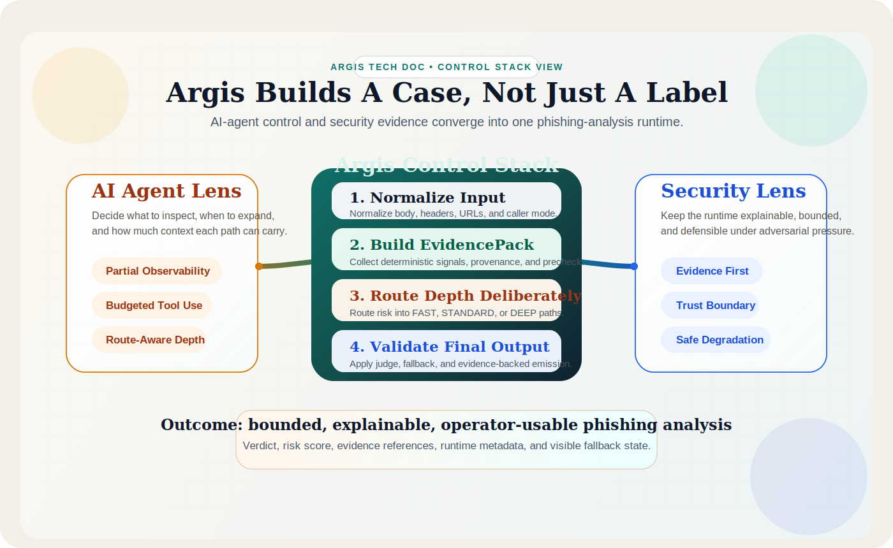
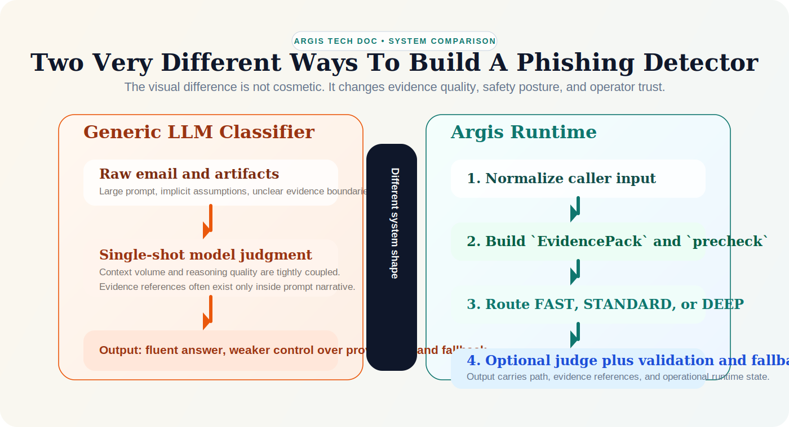
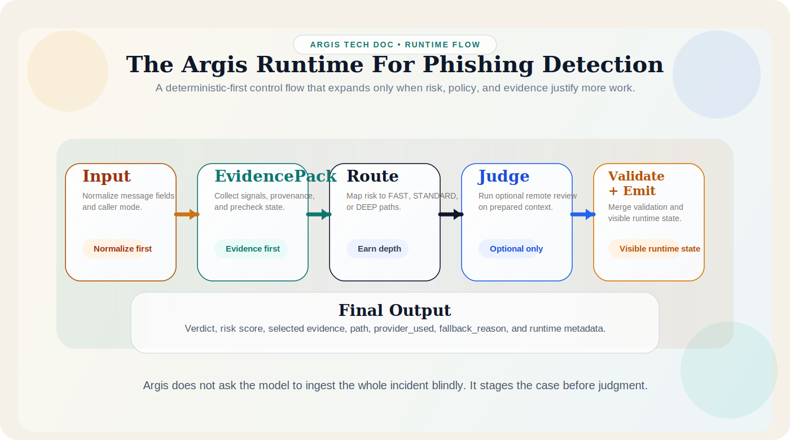

# Why Argis Treats Phishing Email Detection As A Control Stack

*Why the task must be designed both as a controlled agent problem and as a security analysis workflow*

<figure class="article-figure article-figure--hero">
  
  <figcaption>Argis frames phishing detection as one runtime problem viewed from two operational lenses: controlled agent execution and security-grade evidence handling.</figcaption>
</figure>

Phishing email detection is easy to describe and hard to engineer well.

At a superficial level, it looks like a classification problem: read a message, decide whether it is benign or malicious, and return a label. That framing is useful for benchmarks, but it is not sufficient for a production system. Real messages are multi-artifact. They contain headers, sender metadata, visible body text, hidden HTML structure, URLs, domains, and sometimes attachments or linked landing pages. Some of those artifacts are decisive. Some are misleading. Some are expensive or risky to inspect.

That is why a production phishing detector has to solve two problems at once.

From an AI agent perspective, the task is a staged reasoning problem under partial observability. The system must decide what to inspect, when to inspect it, and how much context to carry forward.

From a security expert perspective, the task is an adversarial triage and evidence problem. The system must produce defensible conclusions, preserve traceability, and avoid unsafe collection behavior.

Argis is built around that premise.

It does not treat phishing email detection as a single prompt wrapped in an API. It treats the task as a controlled runtime with explicit stages, bounded tool use, deterministic evidence construction, route-aware depth, optional remote judgment, and validated final output.

That design choice is not branding language. It is the practical consequence of taking both the agent problem and the security problem seriously at the same time.

## The Argis Position In One Page

Argis starts from a different premise than a generic "LLM email classifier."

It assumes that phishing detection should be:

- evidence-first rather than prompt-first
- route-aware rather than uniformly deep
- bounded in side effects rather than eager in expansion
- explainable under audit rather than persuasive in prose
- operationally degradable rather than dependent on a single model path

In concrete terms, that means the runtime is organized around:

- normalized input handling
- deterministic evidence construction
- `precheck` scoring and route selection
- optional judge use after evidence assembly
- validation before final emission
- trust-boundary-aware output handling

The rest of this article explains why that shape is necessary.

## Why This Task Is Not Just Email Classification

A phishing message is rarely defined by one signal alone.

The visible text may look harmless while the HTML hides a mismatched link. The sender domain may look plausible while the reply-to points elsewhere. A landing page may become suspicious only after redirect resolution. An attachment name may be harmless while its contents or embedded QR code change the risk picture. Even apparently strong indicators can be noisy in isolation. Urgency language is common in legitimate operational email. Domain novelty does not automatically mean fraud. Brand impersonation may appear in both malicious and benign contexts.

This means the real task is not only classification. It is evidence assembly under bounded time, bounded cost, and bounded trust.

That constraint matters because a production detector cannot assume:

- that all artifacts are equally informative
- that deeper inspection is always safe or necessary
- that model reasoning alone is sufficient
- that a final verdict is useful without supporting evidence

Those assumptions are exactly where many "LLM email classifier" demos stop being reliable systems.

Argis is designed to avoid that trap. It does not ask a model to infer the entire case from raw artifacts alone. It organizes the case first.

## The AI Agent Perspective

Argis is not a general-purpose chat agent, but the phishing detection task still has an agentic shape when viewed from the runtime.

The system receives incomplete input, works through a staged control flow, selectively expands context, and may invoke additional capabilities only when policy and evidence justify them. That makes the problem look less like single-shot inference and more like controlled task execution.

From that perspective, there are five core engineering requirements, and each one maps directly to a design choice in Argis.

### 1. The Agent Must Work Under Partial Observability

At the start of analysis, the system does not know which artifact will matter most. It has only the initial message representation and whatever fields the caller provided.

A well-designed runtime therefore starts by normalizing input into a stable object model and extracting low-cost deterministic signals first. In Argis, that means building structured evidence before deciding whether the message should remain on a lightweight path or justify deeper analysis.

The point is not to avoid richer analysis. The point is to avoid paying for it blindly.

### 2. The Agent Must Treat Tool Use As Budgeted Expansion

Phishing analysis often benefits from side-effectful capabilities such as bounded fetch, attachment inspection, OCR, QR decoding, or domain analysis. But those capabilities should not be triggered as if more context were always better.

From an agent-design standpoint, every tool call is a decision about:

- latency
- cost
- attack surface
- observability
- downstream context volume

That is why Argis separates `policy`, `tools`, and `orchestrator`. The tools provide deterministic capabilities. The policy layer decides what classes of work are allowed and in what order. The orchestrator turns current evidence into route-aware execution decisions.

This matters because an agent that always expands context is not acting intelligently. It is simply spending budget without discipline.

### 3. The Agent Needs A Structured Working Memory

Many weak agent designs collapse all information into one growing prompt. That is attractive because it simplifies implementation. It is also operationally sloppy.

For phishing detection, the runtime needs a working representation that is more stable than a transient prompt window. In Argis, that role is played by `EvidencePack` and the derived `precheck` output.

That structure allows the runtime to distinguish:

- raw input artifacts
- extracted indicators
- route and path decisions
- judge-facing summaries
- audit and validation metadata

Without that separation, the system becomes harder to explain and harder to control.

### 4. The Agent Should Earn Deeper Reasoning Through Routing

Not every message deserves the same analysis depth.

Argis uses deterministic pre-scoring and internal routes such as `allow`, `review`, and `deep`, which then map to emitted runtime paths such as `FAST`, `STANDARD`, and `DEEP`. That routing step is not only about classification confidence. It is also a context-allocation decision.

From an agent perspective, routing answers a practical question:

**How much more information is this message allowed to buy?**

A low-risk message should not automatically carry the same evidence volume, tool usage, or model budget as an ambiguous or clearly suspicious one. Route-aware expansion keeps the runtime proportional to the case.

### 5. The Agent Must Be Able To Degrade Safely

Production systems cannot assume that optional model evaluation is always available.

If a remote judge is unavailable, or if some deeper analysis path fails, the runtime still needs to produce valid output grounded in deterministic evidence. Otherwise the "agent" is really just a brittle wrapper around an external provider.

Argis treats degraded output as a first-class runtime property. That is important because safe fallback is not a convenience feature. It is part of what makes the system operationally trustworthy.

In product terms, this is one of the clearest separations between Argis and a model-dependent classifier: the system remains useful even when the remote judge path is unavailable.

## The Security Expert Perspective

A security analyst looks at the same task differently.

The central question is not "can the system classify well on average?" It is closer to "can this result be trusted, explained, operated, and defended under adversarial pressure?"

That shifts attention toward a different set of concerns, and Argis is deliberately shaped around them.

### 1. Evidence Matters More Than Eloquence

Security teams do not benefit much from a fluent explanation that cannot be tied back to concrete observations.

An analyst wants to know which signals drove the result:

- sender or reply-to mismatches
- authentication failures or header anomalies
- hidden-link indicators
- domain or URL risk findings
- attachment-derived signals
- specific social-engineering cues

This is why evidence-backed output is not just a product nicety. It is a workflow requirement. High-risk outcomes need machine-referenceable support, not only a plausible narrative.

### 2. False Negatives And False Positives Have Different Costs

From a pure machine learning viewpoint, error rate can look symmetric. In operations, it is not.

A false negative can expose users, credentials, or downstream systems. A false positive can create analyst fatigue, user distrust, and response overhead. Security design therefore needs a runtime that can express ambiguity explicitly instead of forcing every case into a simplistic binary.

That is one reason a `suspicious` middle state and route-aware escalation logic are useful. They acknowledge that some messages need review, deeper inspection, or additional context rather than premature certainty.

### 3. The Input Is Adversarial

Phishing content is not naturally occurring text. It is engineered to mislead both users and detectors.

Attackers can:

- mimic trusted brands and internal functions
- split malicious intent across multiple weak signals
- use redirect chains and shorteners
- place the real lure in attachments or QR codes
- exploit model sensitivity to persuasive wording or irrelevant text volume

A security expert therefore expects the runtime to be skeptical of surface plausibility. Deterministic extraction and artifact-specific checks are not optional add-ons. They are part of handling adversarial input responsibly.

### 4. Collection Behavior Is A Security Decision

In phishing detection, deeper inspection can itself create risk.

Fetching remote content, parsing complex attachments, or expanding artifact context has operational consequences. It affects timeouts, redirects, private-network exposure, and the total side-effect surface. A security-oriented system should therefore make those actions explicit, bounded, and policy-controlled.

This is one of the most important differences between a security runtime and a generic agent demo. The question is not only whether the system *can* inspect something. It is whether it *should*, under the current trust model and configured safety limits.

### 5. Trust Boundaries Must Remain Visible

Security practitioners care about where data came from, where it was processed, and what is allowed to cross an interface boundary.

Argis reflects this in the distinction between API mode and local CLI mode. The API path is intentionally narrower. Evidence is sanitized by default, and richer output requires explicit debug intent. That separation is operationally important because caller-visible convenience should not silently dissolve trust assumptions.

### 6. A Result Is Only Useful If It Fits Operations

Analysts and downstream systems need more than a verdict. They need runtime metadata that explains how the result was produced and whether it came from the normal or degraded path.

Fields such as `path`, `provider_used`, `fallback_reason`, evidence references, and component-level scoring matter because they help operators answer practical follow-up questions:

- Was this result produced entirely from deterministic analysis?
- Did the optional judge run?
- Was deep analysis triggered?
- Was the result downgraded because a provider was unavailable?
- Which evidence should be surfaced in triage or case management?

Security value comes from making those questions answerable.

This is also why Argis emits runtime-visible state instead of hiding execution details behind a single opaque classification result.

## What Argis Is Actually Building

Seen from both perspectives together, Argis is not trying to build a chatbot that sometimes classifies email. It is trying to build a phishing-analysis runtime with explicit control points.

<figure class="article-figure">
  
  <figcaption>The core difference is structural. Argis inserts normalization, evidence construction, routing, validation, and fallback between raw input and final judgment.</figcaption>
</figure>

That runtime has a specific engineering stance:

- `policy` decides what classes of work are allowed and in what order
- `tools` execute deterministic capability logic
- `orchestrator` turns evidence into routing, judge decisions, fallback, and validation
- delivery interfaces expose results without collapsing trust boundaries

This layered control-stack shape matters because it prevents three common failure modes:

- policy leaking into tool implementations
- raw artifact expansion replacing evidence construction
- caller-facing interfaces bypassing runtime safety assumptions

From a product narrative standpoint, this is the core Argis claim: phishing detection becomes more trustworthy when the system is organized around boundaries and evidence, not just around model access.

## Where The Two Perspectives Converge

The AI agent lens and the security lens emphasize different risks, but they point toward the same runtime shape.

Both perspectives push the system toward:

- deterministic evidence construction before optional model judgment
- explicit routing instead of uniform deep inspection
- bounded tool execution instead of uncontrolled expansion
- stable evidence identity instead of prompt-only reasoning
- validation and fallback instead of silent failure
- trust-boundary-aware output handling

This is why the Argis architecture is structured as a control stack rather than a single prompt pipeline.

The agent perspective explains why staged context management is necessary. The security perspective explains why that staged control must remain auditable and bounded.

Taken together, they argue for a simple principle:

**A phishing detector should not behave like a model searching for an answer. It should behave like a controlled runtime building a case.**

## What This Means For System Design

If a team is designing phishing email detection seriously, several design choices follow from the analysis above. These are also the choices Argis makes at the architecture level.

<figure class="article-figure">
  
  <figcaption>The runtime expands in stages. Each step earns the next one instead of assuming maximum context or maximum side effects from the start.</figcaption>
</figure>

### Treat The Task As Multi-Stage By Default

Do not assume the visible body text is the task. The task includes normalization, evidence extraction, route selection, optional deepening, optional model judgment, validation, and final emission.

### Keep Deterministic And Model Roles Separate

Models are useful for ambiguity reduction, summarization, and calibrated judgment in selected cases. They are a poor substitute for deterministic extraction, artifact handling, and safety policy.

### Make Evidence A First-Class Runtime Object

If the system cannot preserve stable evidence references and provenance, it will struggle to remain explainable once the analysis path becomes more complex.

### Spend Context And Side Effects Deliberately

A good runtime does not maximize inspection. It justifies inspection.

### Design For Degraded Valid Output

If optional remote capabilities fail, the system should still produce bounded, interpretable results rather than collapsing into silence or undefined behavior.

## Conclusion

Phishing email detection looks simple only when the task is reduced to a label.

In practice, it sits at the intersection of agent design and security operations. The agent view emphasizes staged reasoning, context budgeting, and controlled capability use. The security view emphasizes evidence, adversarial robustness, trust boundaries, and operationally meaningful output.

Argis is designed around the idea that these are not two separate systems. They are two ways of seeing the same runtime problem.

That is why the architecture centers deterministic evidence, explicit routing, optional judge usage, validation, and safe fallback. The objective is not merely to classify email. It is to produce a decision process that remains bounded, explainable, and usable under real security constraints.

In that sense, Argis is not claiming that phishing detection should avoid models. It is claiming that models should be placed inside a disciplined security runtime rather than mistaken for the runtime itself.

## Related Reading

- [Context Engineering In Argis](./context-engineering-for-deterministic-agents)
- [Argis Architecture Overview](/argis/architecture/)
- [Runtime Flow](/argis/architecture/runtime-flow)
- [Security Boundary](/argis/operations/security-boundary)
