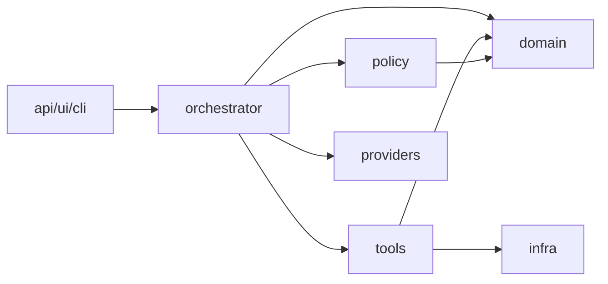
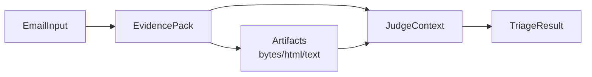
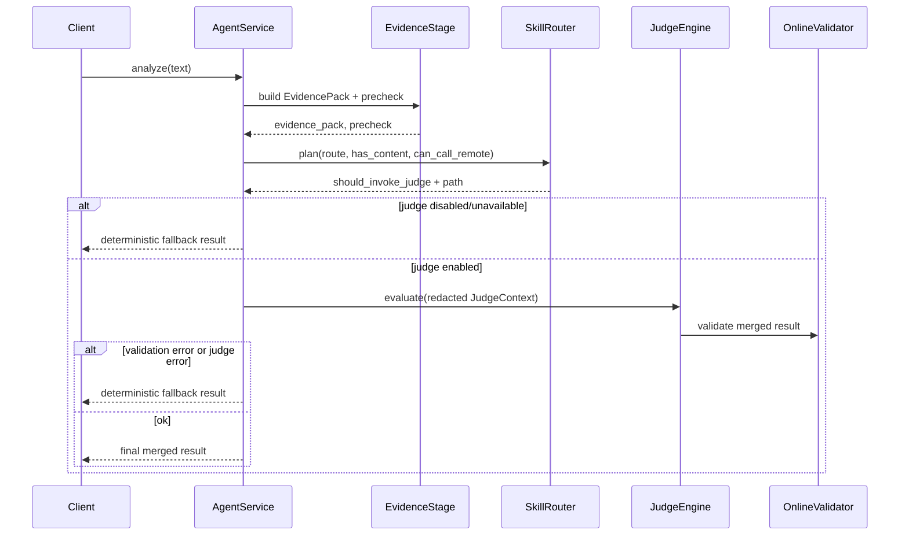
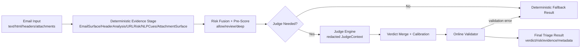

# Argis Phishing Email Detection Agent — Design

Author(s): Argis contributors
Status: Living document
Last updated: 2026-02-25

[[_TOC_]]

## Introduction

Argis is a **policy-centric AI agent** for phishing email detection. It accepts email-like inputs (text/JSON/EML) and returns a `TriageResult` with a verdict, a bounded risk score, actionable indicators, and machine-referenceable evidence.

Argis is engineered for security workloads where operational control and auditability matter as much as detection quality. The agent is **deterministic by default** (no external side effects), and optional deep analysis (e.g., safe URL fetching, attachment expansion) or an optional model judge can be enabled via configuration under explicit runtime policy.

Key design choices:

1. **Evidence-first**: build an `EvidencePack` and a calibrated pre-score before any model involvement.
2. **Policy-centric control**: routing depth, side effects, and budgets are governed centrally by policy, not by individual skills.
3. **Bounded model role**: when enabled, the model acts as a constrained advisor whose output is merged and validated; deterministic fallback is always available.
4. **Budgeted context**: large artifacts are compacted into bounded, referenceable evidence rather than being inlined into prompts.

## Background

This project treats agent engineering as an evolution of software engineering, not a replacement.

1. Traditional software building blocks still exist: modules, contracts, deterministic logic, tests, and SLOs.
2. The model introduces a new control pattern: probabilistic reasoning under explicit policy constraints.
3. `tools` and `skills` preserve composability and auditability by keeping the system modular.

In Argis, an **AI agent is a software architecture pattern**: a controlled execution environment that composes deterministic components with policy-governed, bounded model reasoning. This reframes the model as a component within the architecture rather than the execution engine itself, which is critical for operating under security constraints (auditability, predictable behavior, and safe failure modes).

Concept mapping:

| Traditional software engineering | Argis agent engineering |
| --- | --- |
| Functions/modules | `tools` (atomic deterministic capabilities) |
| Workflows | `skills` (policy-declared units and execution intent) |
| Orchestration | `orchestrator` control stack |
| Configuration/rules | pipeline policy + safety flags |
| Logs/tracing | trace events + provenance + `skill_trace` |
| Release gates | ruff/pytest + offline evaluation regression checks |

Related documents:

1. `docs/Design_template.md` (structure and required sections for design docs)
2. `docs/manual.md` (how to run + configuration + operational guidance)
3. `AGENTS.md` (engineering rules and architectural boundaries)
4. `README.md` (quick start + environment switches)
5. Primary online pipeline: `src/phish_email_detection_agent/orchestrator/pipeline.py`

## Scope

In scope:

1. Online inference flow: `api/ui/cli` -> `orchestrator` -> `policy` + `tools`.
2. Deterministic evidence building, pre-score routing, and controlled deep context collection.
3. Optional judge invocation and verdict merge.
4. Safety posture, traceability, and evaluation/quality gates.

Non-goals:

1. A purely model-driven detector that bypasses deterministic evidence construction.
2. Unbounded network execution or private-network traversal by default.
3. Mixing offline experimental logic into the online serving path.
4. Silent API breaks or indefinite compatibility layers.

## Terminology and contracts

Definitions used throughout this document:

| Term | Meaning in Argis |
| --- | --- |
| Tool | An atomic capability (typically deterministic) that can be executed by code and optionally exposed to the model as a function tool. |
| Skill | A policy-declared unit of workflow intent, composed of tool calls and deterministic logic, enforced by a whitelist. |
| Artifact | Raw or large derived content (attachment bytes, fetched HTML, extracted text) stored separately and referenced from evidence. |
| EvidencePack | Structured evidence object (`src/phish_email_detection_agent/domain/evidence.py::EvidencePack`) produced by the deterministic kernel. |
| Precheck | A deterministic diagnostics bundle built alongside `EvidencePack` (`EvidenceStage.build()` output). |
| Pre-score route | Deterministic route label `allow|review|deep` stored in `EvidencePack.pre_score.route`. |
| Execution path | High-level processing depth `FAST|STANDARD|DEEP` derived from routing decisions. |
| JudgeContext | A bounded, redacted view of evidence prepared for the judge prompt (summaries/snippets + stable references). |
| Context budget | Explicit caps (tokens/bytes/items) that bound extraction, storage, and judge input size. |
| Judge | A constrained model pass that reads a `JudgeContext` and proposes a verdict/score. |
| Validator | Online guardrails to reject invalid outputs (`src/phish_email_detection_agent/orchestrator/validator.py`). |

Primary output contract:

1. `TriageResult` (`src/phish_email_detection_agent/domain/evidence.py::TriageResult`) is the emitted payload.
2. Invariants: `risk_score` is integer-like and in `[0, 100]`; verdict is one of `benign|suspicious|phishing`.

## Requirements

### Functional requirements

1. Accept email-like inputs (text/JSON/EML path) and normalize to `EmailInput` (`src/phish_email_detection_agent/domain/email/models.py::EmailInput`).
2. Extract and score phishing-relevant signals across the attack chain: headers, URLs/domains, attachments, and optional web/attachment deep context.
3. Produce a verdict + risk score + indicators + recommended actions.
4. Provide evidence and provenance for auditability and debugging.
5. Support optional model-assisted judging under explicit policy gating.

### Non-functional requirements

1. Deterministic by default: no external side effects unless explicitly enabled.
2. Bounded side effects: timeouts, redirect limits, byte caps, attachment read caps.
3. Reliability: always return a valid result via deterministic fallback.
4. Maintainability: stable contracts, clear boundaries, no import-cycle regressions.
5. Operational performance: predictable latency profiles with stage-level visibility.
6. Auditability: high-risk verdicts must be evidence-backed with provenance sufficient for debugging and incident response.
7. Budget enforcement: context and artifact processing must respect explicit caps (tokens/bytes/items) and record truncation/omissions in provenance.

## System boundary and deployment assumptions

Argis is designed as a **stateless analysis service** with a deterministic execution core.

Deployment assumptions:

1. **Service form**

   * Argis runs as a stateless service instance.
   * Horizontal scaling is achieved via multiple replicas behind a load balancer.
   * No cross-request state is required for correctness.

2. **Execution locality**

   * All deterministic analysis runs in-process.
   * Optional model calls are external (LLM provider or local runtime).
   * Optional deep analysis (URL fetch, OCR, ASR) is sandboxed and bounded.

3. **Artifact handling**

   * By default, artifacts are held in-memory for the duration of the request.
   * Persistent storage (object store or database) is optional and policy-controlled.
   * Artifact identity (`artifact_id`, hash) is stable within the request scope.

4. **External dependencies (optional)**

   * LLM provider (OpenAI / LiteLLM / Ollama)
   * URL fetch sandbox (internal / container / firejail)
   * External artifact storage (future or deployment-specific)

Non-goal:

Argis is not a workflow engine or long-lived agent runtime; each request is independent and side-effect bounded.

## Architecture overview

Argis follows a control-stack architecture (layered design):

1. `policy` layer: what to do and in what order.
2. `tools` layer: atomic capabilities (bounded execution).
3. `orchestrator` layer: runtime wiring, routing, judge merge, validation.
4. delivery interfaces: `api/ui/cli` call orchestrator only.

Role separation (control vs execution):

- **Policy** governs *decisions* (routing depth, side-effect enablement, model invocation, and budgets).
- **Skills** perform *work* (structured analysis that produces evidence) but do not decide whether they should run or whether side effects are allowed.
- **Tools** are atomic capabilities called by skills, each with explicit bounds and contracts.
- **Orchestrator** coordinates execution, enforces policy decisions, and assembles the final `TriageResult`.

Dependency direction (enforced):

1. `policy` -> `domain`.
2. `tools` -> `domain`, `infra`.
3. `orchestrator` -> `policy`, `tools`, `domain`, `providers`.
4. `api/ui/cli` -> `orchestrator`.

High-level component diagram:



Key implementation anchors:

1. Composition root: `src/phish_email_detection_agent/orchestrator/build.py::create_agent`.
2. Online service: `src/phish_email_detection_agent/orchestrator/pipeline.py::AgentService`.
3. Deterministic kernel: `src/phish_email_detection_agent/orchestrator/stages/evidence_stage.py::EvidenceStage`.
4. Routing: `src/phish_email_detection_agent/orchestrator/skill_router.py::SkillRouter`.
5. Judge: `src/phish_email_detection_agent/orchestrator/stages/judge.py::JudgeEngine`.
6. Guardrails: `src/phish_email_detection_agent/orchestrator/validator.py::OnlineValidator`.

Pipeline (current):

1. Input normalization and EML/JSON parsing: `src/phish_email_detection_agent/domain/email/parse.py`.
2. Header and URL/domain evidence extraction: `src/phish_email_detection_agent/tools/intel/*`, `src/phish_email_detection_agent/domain/url/*`.
3. Conditional deep context collection (safe URL fetch + attachment analysis): `src/phish_email_detection_agent/tools/url_fetch/service.py`, `src/phish_email_detection_agent/tools/attachment/analyze.py`.
4. Evidence pack assembly: `src/phish_email_detection_agent/orchestrator/pipeline.py::_build_evidence_pack`.
5. Skill routing + executor + judge orchestration: `src/phish_email_detection_agent/orchestrator/skill_router.py`, `src/phish_email_detection_agent/orchestrator/stages/*`.
6. Fallback or merged final verdict: `src/phish_email_detection_agent/orchestrator/verdict_routing.py`.

Code layout (high level):

1. `src/phish_email_detection_agent/domain/`: data models and parsing.
2. `src/phish_email_detection_agent/policy/`: fixed chain + registry + skillpack catalog discovery.
3. `src/phish_email_detection_agent/tools/`: deterministic analyzers and tool registry/catalog.
4. `src/phish_email_detection_agent/orchestrator/`: control stack and stage primitives.
5. `src/phish_email_detection_agent/providers/`: model provider adapters (OpenAI, Ollama/LiteLLM path).
6. `src/phish_email_detection_agent/config/`: YAML + env configuration (`defaults.yaml`).
7. `src/phish_email_detection_agent/api/`, `src/phish_email_detection_agent/ui/`, `src/phish_email_detection_agent/cli.py`: delivery interfaces.

## Configuration

Runtime configuration is loaded from YAML + environment and then wired into `AgentService`.

1. Config loader: `src/phish_email_detection_agent/config/settings.py::load_config`.
2. Provider/model wiring: `src/phish_email_detection_agent/providers/llm_openai.py::build_model_reference`.
3. Tool registration for Agents runtime: `src/phish_email_detection_agent/tools/registry.py::ToolRegistry`.

Operationally relevant behaviors:

1. `AgentService.can_call_remote()` returns false when the Agents SDK is unavailable (`importlib.util.find_spec(\"agents\") is None`).
2. For `provider=openai`, judge/model calls require an API key (`MY_AGENT_APP_API_KEY` or `OPENAI_API_KEY`).
3. For local providers (LiteLLM/Ollama path), the model reference is a `LitellmModel` adapter (`src/phish_email_detection_agent/providers/llm_ollama.py`).

Safety-relevant config switches (selected):

1. `MY_AGENT_APP_ENABLE_URL_FETCH` (default false)
2. `MY_AGENT_APP_ALLOW_PRIVATE_NETWORK` (default false)
3. `MY_AGENT_APP_FETCH_TIMEOUT_S`, `MY_AGENT_APP_FETCH_MAX_REDIRECTS`, `MY_AGENT_APP_FETCH_MAX_BYTES`
4. `MY_AGENT_APP_ATTACHMENT_MAX_READ_BYTES`
5. `MY_AGENT_APP_ENABLE_OCR`, `MY_AGENT_APP_ENABLE_AUDIO_TRANSCRIPTION`
6. `MY_AGENT_APP_ENABLE_DEEP_ANALYSIS` (enables URL fetch/OCR/ASR unless explicitly overridden)

## Data and interface contracts

### Inputs

Primary normalized input: `src/phish_email_detection_agent/domain/email/models.py::EmailInput`.

Important fields (conceptual):

1. `text`, `body_text`, `body_html`
2. `headers`, `headers_raw`
3. `urls` (explicit user-provided)
4. `attachments` (file paths)

Parsing entrypoint (online): `src/phish_email_detection_agent/domain/email/parse.py::parse_input_payload`.

### EvidencePack

`src/phish_email_detection_agent/domain/evidence.py::EvidencePack` is the deterministic evidence container.

It includes:

1. `email_meta`: sender/subject/date and counts.
2. `header_signals`: SPF/DKIM/DMARC and relay anomalies.
3. `url_signals`: URL and domain risk flags.
4. `web_signals`: optional safe-fetch HTML indicators.
5. `attachment_signals`: attachment surface heuristics.
6. `nlp_cues`: social-engineering and credential-theft cues.
7. `pre_score`: risk score + route + reasons.
8. `provenance`: timing, limits, and error markers.

### TriageResult

`src/phish_email_detection_agent/domain/evidence.py::TriageResult` is the emitted output payload.

Minimum online invariants:

1. `verdict` in `{benign, suspicious, phishing}`.
2. `risk_score` in `[0, 100]`.
3. `phishing` verdict should include non-empty `indicators` and an `evidence` payload.

### API surface

Current FastAPI endpoint: `src/phish_email_detection_agent/api/app.py`.

1. `POST /analyze`: accepts `{ "text": "...", "model": "optional" }`.
2. Returns analysis result plus `runtime`, `skillpacks`, and `tools` metadata.
3. Online results also include deterministic diagnostics under `precheck`; judge runs also include `validation_issues`.

## End-to-end data flow



Data object roles:

1. **EvidencePack**: canonical deterministic signals and metadata.
2. **Artifacts**: large raw or derived content referenced by `artifact_id`.
3. **JudgeContext**: budgeted projection used for model input.
4. **TriageResult**: final external response.

Artifacts may be in-memory or persisted depending on deployment policy.

## Runtime flow and failure semantics

Online execution is orchestrated by `src/phish_email_detection_agent/orchestrator/stages/executor.py::PipelineExecutor`.

Sequence (simplified):



Failure semantics (must hold):

1. Empty input returns deterministic fallback.
2. Remote/model path unavailable returns deterministic fallback.
3. Judge failure or invalid output returns deterministic fallback.

### Fallback reasons (taxonomy)

Fallback responses may be triggered by:

* `empty_input`
* `policy_blocked`
* `judge_unavailable`
* `judge_error`
* `validation_failed`
* `budget_exceeded`
* `provider_timeout`

The fallback reason should be recorded in runtime metadata for observability.

## Deterministic kernel design

### Evidence-first execution

Argis follows an evidence-first execution model:

1. Deterministic skills and tools construct an `EvidencePack`.
2. A calibrated pre-score is computed and recorded as `allow|review|deep`.
3. The route selects an execution path (`FAST|STANDARD|DEEP`) and gates optional deep context collection.
4. Model usage (judge) is optional and policy-gated; its output is merged and validated.
5. On any failure (model unavailable, judge error, validation failure), Argis returns a deterministic fallback result.

The model, when enabled, acts as a constrained advisor: it consumes a bounded and redacted `JudgeContext` and returns a structured proposal that must pass online validation.

### Fixed skill chain

The deterministic kernel uses a fixed whitelist-driven chain (executed inside `EvidenceStage.build()`):

`EmailSurface -> HeaderAnalysis -> URLRisk -> NLPCues -> AttachmentSurface -> (optional) PageContentAnalysis -> (optional) AttachmentDeepAnalysis -> RiskFusion`

Properties:

1. Skills are registered in a whitelist-backed `SkillRegistry` (`src/phish_email_detection_agent/policy/registry.py`).
2. Skill metadata is fixed and capped at `max_steps <= 5` (`src/phish_email_detection_agent/policy/fixed_chain.py`).
3. Every skill execution records `status` and `elapsed_ms` into `precheck.skill_trace`.

### Deep context trigger

Deep context collection is conditional:

1. Triggered by risk score threshold (`context_trigger_score`) and/or risky URL/attachment flags.
2. Implemented by `src/phish_email_detection_agent/orchestrator/precheck.py::should_collect_deep_context`.

### Pre-score routing

Pre-score is computed via `src/phish_email_detection_agent/orchestrator/precheck.py::compute_pre_score`.

Key parameters (defaults from `src/phish_email_detection_agent/orchestrator/pipeline_policy.py`):

| Parameter | Default | Meaning |
| --- | --- | --- |
| `pre_score_review_threshold` | 30 | `risk_score <= threshold` routes to `allow` |
| `pre_score_deep_threshold` | 70 | `risk_score > threshold` routes to `deep` |
| `context_trigger_score` | 35 | threshold to enable deep context collection |
| `suspicious_min_score` | 30 | low band for ambiguous verdict calibration |
| `suspicious_max_score` | 34 | high band for ambiguous verdict calibration |

Important distinction:

1. `allow|review|deep` is a deterministic routing label for workflow selection.
2. Final `verdict` is separately derived/merged and can still be `phishing` at lower routes.

### Risk score semantics

The `risk_score` is a **monotonic heuristic confidence measure**, not a calibrated probability.

Properties:

1. Range: integer-like value in `[0, 100]`.
2. Monotonicity: higher score indicates stronger phishing evidence.
3. Composition: deterministic aggregation of multiple signal categories.
4. Calibration: threshold tuning is performed offline using benchmark datasets.
5. Interpretation bands:

| Score range | Interpretation                       |
| ----------- | ------------------------------------ |
| 0–29        | Low risk (benign leaning)            |
| 30–69       | Medium risk (ambiguous / suspicious) |
| 70–100      | High risk (phishing likely)          |

The score is designed for **ranking and routing**, not for probabilistic decision-making.

### Determinism and reproducibility boundaries

Argis is deterministic by default, but determinism depends on enabled capabilities.

1. Deterministic kernel (default posture): with URL fetch, OCR, and audio transcription disabled, outputs are reproducible for the same normalized input and attachment bytes.
2. Network-enabled posture: when URL fetch is enabled, results can change over time (remote content, redirects, availability). In this mode, auditability is preserved by including fetch reports and provenance, but strict reproducibility requires capturing fetched artifacts.
3. Provenance: `EvidencePack.provenance` and `precheck.fetch_policy` are treated as part of the reproducibility contract (what limits were applied, what was skipped/blocked).

### Context management and evidence compaction

Phishing analysis can produce more context than a model can (or should) ingest: long email bodies, multiple attachments, and multiple fetched pages. Treating "context" as a chat transcript and dumping everything into the judge is not scalable, is costly, and increases prompt injection risk.

Design goal:

1. Preserve all relevant information as machine-referenceable evidence and artifacts.
2. Provide the judge with a budgeted `JudgeContext` that contains only selected, redacted summaries/snippets and stable references.

#### Artifact vs. EvidencePack vs. JudgeContext

1. Artifacts: raw bytes and large derived text (attachment bytes, fetched HTML, extracted text). Stored separately (ideally via `src/phish_email_detection_agent/orchestrator/evidence_store.py`) with stable IDs and content hashes.
2. EvidencePack: the canonical deterministic container. Stores compact signals, risk flags, extracted entities (URLs/domains), and small snippets (with offsets/anchors) plus `artifact_id` references.
3. JudgeContext: a redacted + compacted projection of `EvidencePack` built under explicit budgets. It is the only object intended to be serialized into the judge prompt.

#### Compaction pipeline (conceptual)

For each content source (email body, attachment, fetched page), tools should follow an explicit compaction pipeline:

1. Extract (bounded): read at most N bytes; extract text/URLs/metadata deterministically.
2. Sanitize: remove scripts/styles, normalize whitespace, decode common encodings, redact secrets, strip binary-ish sections.
3. Segment: chunk into logical units (paragraphs, pages, sections) with stable anchors.
4. Score: rank chunks by phishing relevance (credential requests, urgency, payment, brand + login forms, suspicious domains).
5. Select: keep top-K snippets per artifact and top-M artifacts overall (prioritized by pre-score and risk flags).
6. Summarize (optional, gated): generate short per-artifact summaries only from selected snippets/signals; never require the full raw artifact in the prompt.
7. Record omissions: if truncation happens, record what was omitted and why in provenance.

This is intentionally tool-driven and deterministic-first: the judge should not be responsible for reading full artifacts.

#### Budget controls (to codify in config/policy)

Budgets should be explicit and observable (not implicit "whatever fits"):

1. Judge prompt budget: `judge_context_max_tokens`.
2. Per-source budgets: `max_email_body_chars`, `max_extracted_text_chars_per_artifact`.
3. Entity budgets: `max_urls_in_context`, `max_pages_fetched`, `max_attachments_in_context`.
4. Snippet budgets: `max_snippets_per_artifact`, `max_chars_per_snippet`.
5. Deep-analysis budgets: `max_deep_urls`, `max_deep_attachments`, plus existing fetch/attachment byte caps.

Budget enforcement requirements:

1. If budgets are exceeded, the system must degrade gracefully (keep strongest signals + record truncation).
2. Truncation must never remove all evidence for a high-risk verdict; prefer dropping low-signal artifacts first.
3. Provenance must capture applied budgets so results remain auditable.

#### Tool cooperation patterns (email + attachments + web)

1. URL flow: `EmailSurface` and `AttachmentSurface` extract URLs -> `URLRisk` scores them -> `PageContentAnalysis` fetches only top-risk URLs -> results become compact `web_signals` + snippets with `artifact_id` references.
2. Attachment flow: `AttachmentSurface` emits metadata + embedded URLs + lightweight strings -> `AttachmentDeepAnalysis` runs only for top-risk attachment candidates -> emits compact signals (macro flags, embedded objects, extracted URLs, suspicious strings) and top snippets.
3. Cross-linking: when a URL is extracted from an attachment/page, record `(source_artifact_id, url)` so the attack chain remains traceable without inlining the full source.
4. Evidence identity: every snippet included in `JudgeContext` should carry enough reference info (`artifact_id`, page/offset, extractor/tool name) to locate its origin.

#### HTML compaction and encoding normalization (recommended tools)

Fetched web pages and attachments commonly contain HTML noise and obfuscation layers. To keep context bounded and improve signal extraction, treat HTML parsing + decoding as first-class deterministic tool capabilities.

HTML compaction (fetched pages):

1. Prefer DOM parsing over regex (e.g., BeautifulSoup/bs4 or an equivalent tolerant HTML parser).
2. Drop `script/style/noscript`, comments, and boilerplate; normalize whitespace.
3. Extract phishing-relevant structures as compact signals:
   - forms (`<form action=...>`, `password` inputs, hidden inputs), meta refresh, external script sources, and outbound links/domains
4. Produce bounded snippet candidates from visible text (title + top-K high-signal paragraphs) with stable anchors (offsets/selectors) and a truncation marker when applicable.

Encoding normalization (URLs + text + HTML attributes):

1. Normalize common encodings used for obfuscation: percent-encoding (URL encoding), HTML entities, and safe charset decoding (from headers/meta).
2. Detect and boundedly decode base64 in common places (query params, hidden fields, `data:` URIs), with strict limits:
   - max decode bytes
   - max expansion ratio
   - max decode depth (e.g., URL-encoded -> base64 -> text)
3. Always record a decode chain in provenance (what transforms were applied, what failed, what was skipped due to budgets).
4. Never execute decoded content; treat it as untrusted text/bytes for analysis only.

## Judge integration design

The judge is treated as a constrained advisor.

Judge inputs:

1. A redacted, budgeted `JudgeContext` built from `EvidencePack` (`src/phish_email_detection_agent/evidence/redact.py::redact_value`).
2. The prompt explicitly treats evidence text as untrusted.

Judge outputs:

1. A structured `JudgeOutput` JSON (`src/phish_email_detection_agent/domain/evidence.py::JudgeOutput`).
2. Merged by explicit rules (`src/phish_email_detection_agent/orchestrator/verdict_routing.py`).
3. Validated by `OnlineValidator` (`src/phish_email_detection_agent/orchestrator/validator.py`).

Judge output requirements:

1. Each high-impact claim (risk reason, indicator, or verdict justification) should reference:

   * `artifact_id`, and/or
   * `snippet_id`, and/or
   * signal category
2. The validator checks that referenced evidence exists.
3. Unsupported claims are rejected and treated as judge failure.

This prevents hallucinated evidence from influencing decisions.

Merge principles:

1. Deterministic score >= phishing threshold remains phishing.
2. Judge can promote/demote based on confidence and policy thresholds.
3. Online product decision currently collapses `suspicious` to `phishing` after merge (binary-facing triage).

Safety note (design requirement):

1. The tool surface exposed to the judge must not allow bypassing runtime side-effect policy.
2. Function tools should enforce enablement from runtime config, not model-controlled flags.

### Side-effect policy enforcement (important)

Do not rely on prompts alone to enforce safety. Side-effect policy must be enforced in code.

1. If a function tool accepts a model-controlled `enable_*` flag for side effects (fetch/OCR/ASR), it creates a policy bypass risk.
2. Preferred pattern: the tool implementation derives enablement from `AgentService` (or an equivalent runtime policy object) rather than from model-supplied arguments.
3. If a tool must expose a toggle (for interactive use), it must still hard-check the runtime policy and refuse when disabled.

### Judge authority and override rules

The judge operates under strict bounded authority.

1. The judge **cannot introduce new evidence**; all claims must reference existing evidence.
2. Deterministic high-risk decisions cannot be downgraded below `suspicious` unless explicitly allowed by policy.
3. The judge cannot override:

   * side-effect policy
   * safety blocks
   * validation constraints
4. Judge influence is bounded by policy-defined merge thresholds.
5. If the judge output:

   * lacks evidence references, or
   * violates schema or policy

   the system returns the deterministic fallback result.

The deterministic kernel remains the primary decision authority.

## Interactions

This design has several cross-component interactions that are best read together:

1. `EvidenceStage` -> `SkillRouter`: deterministic pre-score routing (`allow|review|deep`) selects the execution path and whether deep context collection is attempted.
2. `SkillRouter` -> `JudgeEngine`: judge invocation is policy-gated (requires `can_call_remote`) and optional by route.
3. `JudgeEngine` -> `OnlineValidator`: merged outputs are validated online; validation failures trigger deterministic fallback.
4. Tools -> runtime policy: side-effectful tools (fetch/OCR/ASR) must consult runtime policy and remain opt-in and bounded.

## Tools, skills, and governance

### Tools

Tools are atomic capabilities with explicit constraints.

In this repo, tools exist in two forms:

1. Deterministic analyzers under `src/phish_email_detection_agent/tools/`.
2. Function tools registered for Agents runtime (`src/phish_email_detection_agent/tools/registry.py`, `src/phish_email_detection_agent/tools/openai/builtin.py`).

Tool requirements:

1. Deterministic outputs for deterministic inputs (when no external side effects are enabled).
2. Explicit bounding policy for any side-effectful operations.
3. Clear contracts and test coverage.

### Skills

Skills represent policy-declared workflow units.

Current online deterministic execution uses fixed built-in skills (`src/phish_email_detection_agent/policy/fixed_chain.py`) executed inside `EvidenceStage`.

Skillpacks:

1. Local skillpacks are discovered and surfaced in runtime metadata (`src/phish_email_detection_agent/policy/catalog.py`).
2. Skillpack discovery is currently informational (UI/API metadata) rather than altering the fixed deterministic chain.

### Current gaps and follow-ups

These items are important to track explicitly because they affect safety, maintainability, and long-term architecture hygiene.

1. `src/phish_email_detection_agent/orchestrator/evidence_store.py` provides stable evidence IDs, but the online pipeline currently relies on `EvidencePack` as the primary evidence container (no store/graph integration yet).
2. `src/phish_email_detection_agent/orchestrator/tool_executor.py` provides a normalized execution wrapper, but the deterministic kernel currently calls tools directly (no unified retry/telemetry contract yet).
3. Skillpacks are discovered and surfaced, but do not currently participate in the default deterministic skill chain. If skillpacks become executable policy, the integration must preserve whitelist semantics and bounded side effects.
4. Judge context budgeting/compaction is currently described as a design requirement, but needs to be made a first-class module (explicit budgets, truncation provenance, and a `JudgeContext` builder) to prevent prompt bloat and improve tool-to-judge handoff quality.

### Routing contract

Two routing representations exist and are formally mapped:

| Pre-score route | Execution path | Meaning                           |
| --------------- | -------------- | --------------------------------- |
| allow           | FAST           | Minimal analysis, no deep context |
| review          | STANDARD       | Normal analysis, judge optional   |
| deep            | DEEP           | Deep context collection enabled   |

Contract:

1. `allow|review|deep` is **internal deterministic routing**.
2. `FAST|STANDARD|DEEP` is the **external execution terminology** used in logs, metrics, and UI.
3. External APIs must not expose ambiguous or mixed routing labels.

## Implementation status

| Component                            | Status      |
| ------------------------------------ | ----------- |
| EvidenceStage deterministic pipeline | Implemented |
| Pre-score routing                    | Implemented |
| Judge integration                    | Implemented |
| Online validation                    | Implemented |
| JudgeContext budgeting module        | Partial     |
| Evidence store integration           | Planned     |
| ToolExecutor unified execution       | Partial     |
| Telemetry dashboards                 | Planned     |

## Safety, security, and privacy

### Safety defaults

Safe defaults are configured in `src/phish_email_detection_agent/config/settings.py`:

1. URL fetch disabled by default (`MY_AGENT_APP_ENABLE_URL_FETCH=false`).
2. Private network blocked by default (`MY_AGENT_APP_ALLOW_PRIVATE_NETWORK=false`).
3. OCR and audio transcription disabled by default.
4. Redirect, timeout, and max-byte caps on fetch.
5. Attachment read cap via `AttachmentPolicy.max_read_bytes`.
6. URL fetch supports sandbox backends `internal`, `firejail`, `docker` (`MY_AGENT_APP_URL_FETCH_BACKEND`).
7. Safe fetch blocks executable-style binary downloads (e.g., `application/octet-stream`) as `binary_download_blocked`.

One-switch deep analysis:

1. `MY_AGENT_APP_ENABLE_DEEP_ANALYSIS=true` enables URL fetch, OCR, and audio transcription unless explicitly overridden.

### Threat model (selected)

1. Prompt injection via email/web content.
2. SSRF and private-network probing via URL fetch.
3. Malicious or oversized content (attachments, HTML, redirect chains).
4. Brand impersonation and IDN/punycode spoofing.
5. Model output invalidity (schema violations, hallucinated evidence).
6. Obfuscation via multi-layer encodings (percent-encoding, HTML entities, base64, `data:` URIs).

Mitigations (current and required):

1. Redact evidence before judge; treat all content as untrusted.
2. Safe fetch enforces scheme allowlist, DNS resolution checks, private IP blocking, redirect limits, and byte caps.
3. Attachment analysis is static-first with explicit read caps and optional OCR/ASR.
4. Online validator rejects invalid outputs.
5. Deterministic fallback is always available.
6. Deterministic HTML compaction + encoding normalization with explicit budgets and decode-chain provenance (see "Context management and evidence compaction").

### Privacy

1. Redaction masks emails and obvious tokens and sanitizes URL query params.
2. Judge receives redacted evidence; raw content should be treated as sensitive.
3. Any future persistence of evidence should have an explicit retention policy.

### Artifact retention and lifecycle

Default behavior:

1. Artifacts are stored in-memory and discarded after request completion.
2. No persistent storage is required for normal operation.

Optional persistent mode (deployment-specific):

1. Artifacts may be stored in an external object store.
2. Retention period must be explicitly configured.
3. Access must be restricted and audited.
4. Artifact deletion policies must comply with organizational privacy requirements.

Provenance should record whether artifacts were persisted or transient.

## Performance model

Execution latency depends on the selected execution path.

| Path     | Characteristics                     | Dominant cost |
| -------- | ----------------------------------- | ------------- |
| FAST     | Deterministic only                  | CPU-bound     |
| STANDARD | Deterministic + optional judge      | Model latency |
| DEEP     | Network fetch + artifact processing | Network + CPU |

Latency contributors:

1. EvidenceStage: CPU-bound parsing and feature extraction.
2. URL fetch: network latency and redirect handling.
3. Attachment processing: I/O and text extraction.
4. Judge: external provider latency.

Timeouts and byte limits are enforced per stage to bound worst-case latency.

## Observability and operations

Current visibility:

1. `AgentService.analyze_stream()` emits stage events with `stage/status/message/data`.
2. Evidence provenance includes timings and limits/errors.

Recommended production instrumentation (to implement and enforce):

1. Stage latency histograms per stage name.
2. Counters: total requests, judge invoked, judge failed, fallback returned, validation errors.
3. Side-effect counters: bytes fetched, redirects followed, attachments analyzed, OCR/ASR enabled rates.
4. Resource tracking: CPU and RSS per request at service boundary.
5. Context budgeting metrics: truncation rate, selected snippets count, and judge-context size (tokens/bytes).

Operational playbooks:

1. Degraded mode: disable judge and deep context collection, rely on deterministic kernel.
2. Incident response: investigate spikes in fallback rate, validation errors, or fetch blocks.

## Evaluation and quality

Evaluation must account for both correctness and system properties.

Quality dimensions:

1. Detection quality: precision/recall/F1, false positives/negatives, evidence-backed verdict rate.
2. Performance: end-to-end p50/p95/p99, stage latency, throughput.
3. Efficiency: CPU/memory/network, model-call cost, deep-analysis frequency.
4. Reliability: success rate, timeout rate, judge failure rate, validation issue rate.

Offline evaluation:

1. `src/phish_email_detection_agent/orchestrator/evaluator.py` provides binary metrics (with configurable suspicious handling).
2. Offline evaluation is the correct place for calibration experiments and regression tracking.

## Testing

Mandatory repo checks:

```bash
uv sync
ruff check src tests docs scripts
pytest -k 'not hf_phishing_email_balanced_sample'
```

Recommended for control-stack changes:

```bash
pytest tests/orchestrator/test_control_stack.py
pytest tests/orchestrator/test_text_prescore.py tests/orchestrator/test_pipeline_smoke.py
```

Release discipline:

1. No architecture boundary violations.
2. No import-cycle regressions.
3. Changes to outputs require docs/tests updates in the same change.

### Change management and API stability

Argis should evolve like a production service, not like an experimental notebook.

1. Avoid breaking response keys unless explicitly approved; if change is required, ship a migration plan and a removal milestone.
2. Treat tool and skill interfaces as public contracts once exposed via API/runtime metadata.
3. If compatibility layers are introduced, time-bound them and document the removal criteria.

## Task breakdown

The table below is a rough breakdown of follow-up work to implement or harden the requirements in this document. Estimates
assume a single engineer and can be parallelized.

| Task | Time Estimate | Tracker |
| --- | --- | --- |
| Judge-context budgeting + provenance hardening | 1 week | |
| Evidence store integration (stable IDs + hashes) | 1 week | |
| Unify deterministic tool execution via `ToolExecutor` | 2 days | |
| Telemetry + fallback taxonomy + dashboards | 3 days | |
| Offline evaluation regression gates | 1 week | |

### Judge-context budgeting + provenance hardening

Codify budgets (`judge_context_max_tokens`, snippet limits, artifact selection rules) and ensure truncation/omissions are
recorded in provenance so results remain auditable under constrained context.

### Evidence store integration (stable IDs + hashes)

Make `src/phish_email_detection_agent/orchestrator/evidence_store.py` the canonical mechanism for artifact identity and
retrieval across the pipeline (email bodies, fetched pages, attachment extracts).

### Unify deterministic tool execution via `ToolExecutor`

Route deterministic tool calls through `src/phish_email_detection_agent/orchestrator/tool_executor.py` to standardize
timeouts, retries (where safe), telemetry, and error-to-provenance mapping.

### Telemetry + fallback taxonomy + dashboards

Add stage-level metrics and a stable fallback taxonomy (judge errors, validation failures, policy blocks) to make degraded
behavior observable and actionable.

### Offline evaluation regression gates

Establish a benchmark harness and release gate thresholds for precision/recall/F1 and key safety/latency metrics.

### 12-month roadmap (engineering view)

| Phase | Time Window | Primary Objective | Deliverables |
| --- | --- | --- | --- |
| Phase 1 | M1-M3 | Measurement foundation | end-to-end telemetry, stage-level dashboards, baseline benchmark suite |
| Phase 2 | M4-M6 | Quality and calibration hardening | threshold tuning playbook, judge calibration experiments, FP/FN analysis |
| Phase 3 | M7-M9 | Reliability and scaling | load validation, fallback taxonomy, resilience drills |
| Phase 4 | M10-M12 | Governance and productization | formal SLO policy, release gates, architecture review checklist |

## One-page review summary

### Architecture snapshot



### KPI and SLO framework

The following are initial targets and must be agreed with product/security stakeholders.

| Domain | KPI | Target / SLO |
| --- | --- | --- |
| Detection Quality | Phishing Recall | >= 0.92 on agreed benchmark set |
| Detection Quality | Precision | >= 0.90 on agreed benchmark set |
| Detection Quality | F1 | >= 0.91 |
| Reliability | Successful Response Rate | >= 99.9% |
| Reliability | Deterministic Fallback Rate | <= 5% (excluding planned degraded windows) |
| Latency | End-to-End p95 | <= 2.5s (FAST/STANDARD mixed profile) |
| Latency | End-to-End p99 | <= 5.0s |
| Efficiency | CPU per request | baseline tracked, <= 15% regression per release |
| Efficiency | Memory per request | baseline tracked, <= 15% regression per release |
| Cost | Judge Invocation Rate | policy controlled and budget-aligned |
| Trust | Evidence-backed High-Risk Verdict Rate | 100% for phishing verdicts |
| Safety | Private-Network Access Violations | 0 |

Metric definitions (operationally important):

1. Successful Response Rate: fraction of requests returning a valid `TriageResult` payload (validator passes, required keys present).
2. Deterministic Fallback Rate: fraction of requests that return the deterministic fallback path (for example, `provider_used` ends with `:fallback`).
3. Latency percentiles: measured at the service boundary for the full request, and stage-level where available.

## References

### Internal

1. `docs/Design_template.md`
2. `docs/manual.md`
3. `AGENTS.md`
4. `README.md`
5. `src/phish_email_detection_agent/orchestrator/pipeline.py`
6. `src/phish_email_detection_agent/orchestrator/stages/evidence_stage.py`
7. `src/phish_email_detection_agent/orchestrator/skill_router.py`
8. `src/phish_email_detection_agent/orchestrator/stages/judge.py`
9. `src/phish_email_detection_agent/orchestrator/validator.py`
10. `src/phish_email_detection_agent/config/settings.py`

### External

1. RFC 5322 (Internet Message Format): https://www.rfc-editor.org/rfc/rfc5322
2. RFC 7208 (SPF): https://www.rfc-editor.org/rfc/rfc7208
3. RFC 6376 (DKIM): https://www.rfc-editor.org/rfc/rfc6376
4. RFC 7489 (DMARC): https://www.rfc-editor.org/rfc/rfc7489
